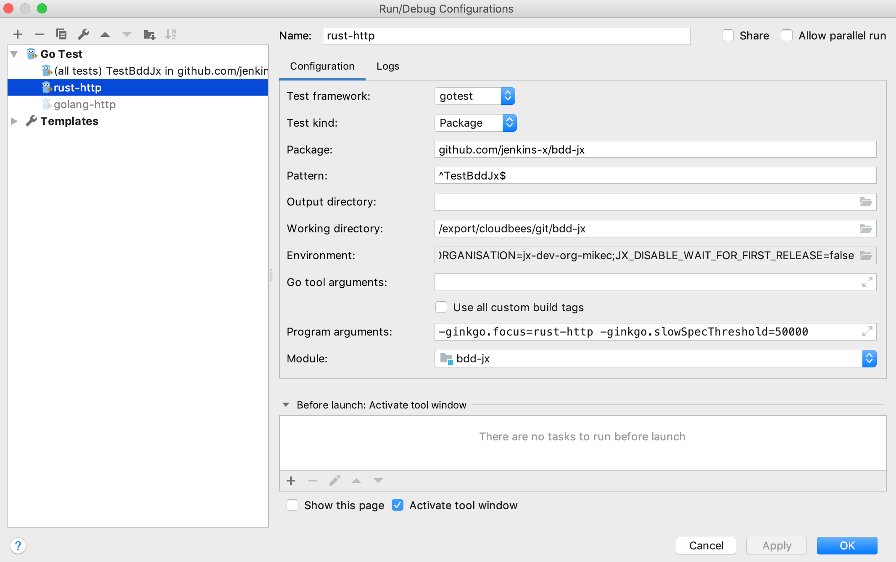

# Debugging your tests

## Development Environments

### Goland
* To run specific test change the value for `ginkgo.focus=`
* To run all tests (may take a long time) do not set a value for `ginkgo.focus`


### Visual Studio Code
Microsoft already has [excellent general guidance](https://github.com/Microsoft/vscode-go/wiki/Debugging-Go-code-using-VS-Code) for debugging Go in VS Code. Below is an example 
of how to set this up specifically for these BDD tests.

1. From the drop-down menus, select _Debug_ --> _Open Configurations_. This should create a `launch.json` file for you, if there wasn't one already set up.

2. Some of the default settings for this file will be fine, but others need to be changed. This is especially true if you want to test against particular repositories. VS Code's Intellisense feature will let you hover over these settings and see possibilities. 

3. This file should also contain the environment variables you'd set up were you running the tests outside of VS Code. 

Below is an example file, showing a debug configuration called __Debug-BDD__. where the tests will be run using the following options. Settings which were not changed from when VS Code auto generates `launch.json` are marked as (_default_). 
* name: The name of your Debug configuration
* type: go (_default_)
* request: launch (_default_)
* mode: test
* program: `"${fileDirname}"` (_default_)
* `env`: Any environment variables you need to set, as described in [the README](Readme.md), including:
    * `"GIT_ORGANISATION":"quality-assurance"`
    * `"GHE_USER":"super-tester"`
    * `"GHE_PROVIDER_URL":"https://github.some-organization.com"`
    * `"GHE_EMAIL":"super-tester@some-organization.com"`
    * `"GHE_TOKEN":"tokentokentokentokentokentokentokentoken"`
* args: 
    * Any [command-line arguments you need to pass to Ginkgo]((http://onsi.github.io/ginkgo/#the-ginkgo-cli)), such as `-test.v`, which provides verbose output
    * Specific test cases, in the form of `-gingko.focus` arguments. In the example below, well run the `node-http` test.
```
{
    "version": "0.2.0",
    "configurations": [
        {
            "name": "node-http",
            "type": "go",
            "request": "launch",
            "mode": "test",
            "program": "${fileDirname}",
            "env": {
                "GIT_ORGANISATION":"quality-assurance",
                "GHE_USER":"super-tester",
                "GHE_PROVIDER_URL":"https://github.some-organization.com",
                "GHE_EMAIL":"super-tester@some-organization.com",
                "GHE_TOKEN":"tokentokentokentokentokentokentokentoken",
            },
            "args": [
                "-test.v",
                "-ginkgo.focus",
                "node-http"
            ]
        },
        {
            "name": "rust-http",
            "type": "go",
            "request": "launch",
            "mode": "test",
            "program": "${fileDirname}",
            "env": {
                "GIT_ORGANISATION":"quality-assurance",
                "GHE_USER":"super-tester",
                "GHE_PROVIDER_URL":"https://github.some-organization.com",
                "GHE_EMAIL":"super-tester@some-organization.com",
                "GHE_TOKEN":"tokentokentokentokentokentokentokentoken",
            },
            "args": [
                "-test.v",
                "-ginkgo.focus",
                "rust-http"
            ]
        }
    ]
}
```